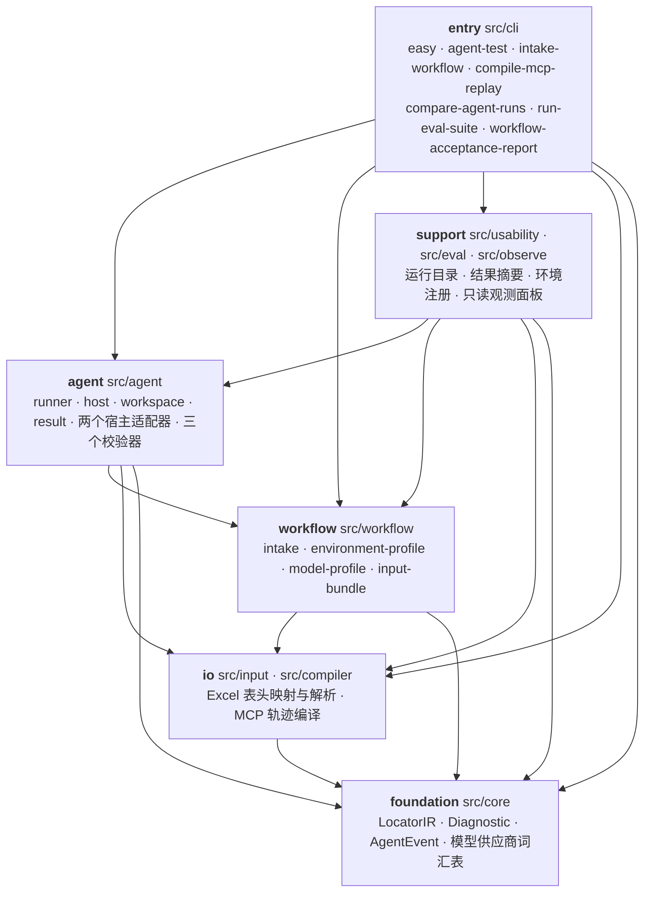

# Auto-Test

面向测试工程师的 AI 辅助 Web 自动化测试框架：测试工程师交付一份 Excel 用例（可选 brief 与图片），
一个持久 Agent 线程自主完成**理解业务 → 探索页面 → 真实执行 → 业务断言 → 失败恢复 → 结构化交付**，
框架负责让这次执行**有环境、有边界、有证据、可恢复、可交付**。

> **第一次使用**（安装 → 注册环境 → 跑出第一份结果）请看 [快速操作指南](docs/quick-start.md)；
> Windows 双击启动看 [Windows 快速操作指南](docs/windows-quick-start.md)。
>
> **本 README 是给接手这个仓库的人看的**：它解释系统为什么长成这样、模块怎么分层、
> 依赖往哪个方向流、改一处代码要动哪些文件。业务快速上手不在本文范围。

---

## 目录

- [一、这个仓库到底在做什么](#一这个仓库到底在做什么)
- [二、设计哲学：从第一性原理推出全部结构](#二设计哲学从第一性原理推出全部结构)
- [三、系统模块与依赖关系](#三系统模块与依赖关系)
- [四、模块之间的接缝](#四模块之间的接缝)
- [五、一次 Run 的调用链](#五一次-run-的调用链)
- [六、仓库地图](#六仓库地图)
- [七、改动指南：动哪里、读哪些文件](#七改动指南动哪里读哪些文件)
- [八、确定性检查与交付纪律](#八确定性检查与交付纪律)
- [九、当前边界与未验收事项](#九当前边界与未验收事项)
- [十、文档路由与历史遗留](#十文档路由与历史遗留)

---

## 一、这个仓库到底在做什么

仓库里有**两个互不相同的系统**，读之前必须分清，否则会把一半的文件当成无关噪音：

| 面 | 是什么 | 主要位置 |
|---|---|---|
| **产品面** | AgentHost 测试执行框架：Excel 用例 → 真实浏览器执行 → 结构化结果 + 回归资产 + 只读观测面板 | `src/agent/`、`src/workflow/`、`src/cli/`、`src/observe/` |
| **治理面** | 让 AI agent 自动完成「issue → 实现 → 审查 → PR」的可信交付流水线（AFK） | `.github/workflows/`、`.sandcastle/` |

两面共享同一套安全底线（凭据隔离、默认分支保护、确定性 CI），但**产品面不调用治理面**：
治理面产出的 PR 改的是产品面代码。本文档以产品面为主，治理面见 [第八节](#八确定性检查与交付纪律)
与 [docs/afk-workflow.md](docs/afk-workflow.md)。

产品面的对外能力分四组：

- **执行**：`npm run agent:test`（非交互）与 `npm run easy`（中文交互菜单，Windows 入口）。
- **输入编制**：`npm run intake:workflow`、`npm run report:workflow`（工作流型 Excel 的独立解析与验收报告）。
- **回归资产**：成功 Run 自动生成 Playwright spec；`npm run compile:replay` 迁移历史 Run。
- **观测**：`npm run easy -- dashboard`，只读浏览器面板（运行列表 / 详情 / SSE 实时事件 / 证据查看）。

---

## 二、设计哲学

这一节是本文档的核心。**下文每一个模块的存在理由，都可以回溯到这里的某一条推论**；
判断一处改动是否违背设计意图，也回到这里判断。

### 起点：三个不可协商的事实

1. **首次接入一个新网站，页面语义只有运行时才知道。** 登录后才出现菜单，操作后才出现弹窗，
   表格列和空状态可能动态变化，同一个按钮会随业务状态改变含义。执行前无法预测世界。
2. **被测系统承载真实业务写入。** 充电、下单、结算这类用例会改变真实数据；
   一次误判成 `passed` 比一次误判成 `failed` 昂贵得多，而"看起来成功了"恰恰是最危险的结论。
3. **模型有真实推理能力，但没有可靠边界。** 它可能编造定位器、可能把一次点击当成一次通过、
   可能在证据不足时给出高置信度结论、可能被页面文本注入。

### 推论一：执行主体必须是 Agent，不是编译器

事实 1 直接否定了「先把用例编译成确定性程序、再开始执行」这条路——
那等于要求编译器在没有完整观察世界之前预测世界。

这是本项目最重要的一次架构反转，代价是一次完整的推倒重来：早期版本按
「自然语言 → Test Case IR → 严格 Schema → Playwright 代码 → 确定性 Runtime」构建，
并配套 Planner / Explorer / Refiner 三段式；它在小型确定性用例上工作正常，
但在真实跨系统业务上出现三个结构性缺陷：

- **Schema 过早固化不确定判断。** 严格校验迫使模型在证据不足时就决定页面层级、
  表头、Locator 策略、实体 ID 正则；一旦进入保护投影，后置修复反而改不动。
- **角色之间靠 JSON 摘要通信。** Planner 没有真实页面，Explorer 没有业务推理，
  Refiner 只看到压缩证据；任何摘要偏差在下一阶段被放大。
- **首次执行与稳定回归被错误合并。** 两者需要完全不同的能力，却共用一条链路。

所以最终形态是：

> **首次接入新场景时，选定的 AgentHost 是唯一负责理解、探索、计划、执行、纠错和业务判断的
> 智能主体；Auto-Test 只保留那些必须跨模型、浏览器和机器中断持续存在的控制能力。**

这就是 **thin harness（薄外壳）**：框架不再实现第二套页面语义、第二套 Planner、
第二套表单判断器或低智能业务 Runtime。完整复盘见
[架构实践复盘](docs/architecture-journey-ir-runtime-to-codex-native.md)。

### 推论二：既然判断权交给 Agent，边界就必须由 harness 执行，而不是由提示词请求

提示词是请求，不是保证。因此所有"不能做的事"都落在**代码**里，而不是落在 instruction 里。
推论二在代码里落成五道硬边界：

| 边界 | 载体 | 保证什么 |
|---|---|---|
| 输入身份不可漂移 | `agentTestPrompt` 中的 `workflowId` + `sourceSha256`（`src/agent/prompt.ts`） | 整轮 Run 的目标输入被冻结，模型改不了 |
| 结果必须过合同 | `finalResultProblems`（`src/agent/runner.ts:172`） | 拒绝身份漂移、用例缺失/重复、零证据、终态与失败分类不一致 |
| 副作用必须可核销 | `enforceMutationLedger`（`src/agent/result.ts:218`） | Ledger 有 `pending` 时该 Run 不能被报成通过——**是账本，不是模型，决定终态** |
| 环境阻断必须可恢复 | `enforceEnvironmentRequirements`（`src/agent/runner.ts:347`） | 环境类阻断必须关联同一 case 的已保存证据需求，不能用通用证据批量造结论 |
| 权限只在 Profile | Environment Profile 的 `policy.allowWrite` / `allowDestructive` | 写权限不由推断的 case 风险替代，也不由提示词放宽 |

副作用（事实 2）单独展开：harness 不阻止写入，而是要求写入**可核销**。
一个需要中断恢复的外部业务写入登记为一条 Mutation，Run 结束前必须验证接受或补偿结果
（`pending=0`）；普通导航、读取和字段输入不逐动作登记。

### 推论三：确定性只覆盖"可确定性验证的东西"

把判断权交给 Agent 之后，框架仍然必须做确定性校验——但范围被严格限定为六类：
**输入身份、用例完整性、证据存在、结果一致性、权限、环境需求与副作用恢复**。
超出这六类的判断（"这个页面现在是什么意思"）一律交回同一个执行线程。

判断一项逻辑该不该留在 harness，标准是三条：

1. 它是否必须在模型或浏览器中断后仍可靠存在；
2. 它是否属于权限、身份、输入完整性或副作用恢复不变量；
3. 它是否可以在不了解具体页面业务语义的情况下确定性验证。

由此推出一条容易被违反的规则：**不允许存在第二个比执行线程上下文更少、却能覆盖其业务结论的
Planner / Reporter / 裁决器。** 连测试人员看到的失败摘要也是确定性投影，不调用新模型。

### 推论四：失败是常态，所以 Run 必须可恢复、可轮换、可分片

模型会因为额度耗尽、限流、上下文超限、格式错误或进程中断而失败。
把 Run 做成一个不可恢复的内存对象，等于把外部不稳定变成内部数据丢失。因此：

- **Run 目录即 Run 本体。** 私有目录（POSIX `0700`）落盘状态、事件、逐 case 事实、Ledger；
  `codex-agent.events.jsonl` **先落盘再推送**，终端看到的就是事后能追溯的。
- **大工作簿必须分片。** 长套件被自动切成至多 8 条 case 的通用 execution epoch。
  单个 epoch 只要求 AgentHost 交付当前有界 case 集，最终完整结果由框架按不可变 Manifest 顺序
  确定性聚合——这既避免"一次 JSON 输出要覆盖几百条用例"撞上输出上限，
  也避免一个超长工具回合撞上上下文上限。
- **物理线程可轮换，Run 语义不变。** 额度、限流、上下文或输出容量错误都会触发
  物理 AgentHost 线程轮换；轮换前写 checkpoint（工作记忆），轮换后 `--resume` 继续。
  业务上下文、浏览器状态、证据、Ledger 和逐 case 事实始终属于同一个 Run。
- **未完成的工作不会被重做。** 已写入逐 case 结果库的 case 不会重跑；
  恢复时先重读 pending mutation 并重新观察真实业务状态，不盲目重放写入。

### 推论五：凭据不能进入模型上下文、日志、报告或源码

Provider API Key、测试账号口令、真实个人数据都属于**私有材料**：

- 密钥只以环境变量名（`envKey`）出现在配置里，值从不落盘到 Profile；
- Excel 中的凭据在 intake 阶段被替换为 `secretRef`，原始值放在不可枚举属性里，
  序列化 Manifest 不会泄漏；
- 默认 `direct` 模式下，本轮运行值由 `run-values.json` 显式交给 Agent（并在提示词中给出路径）；
  `--opaque-test-data` 则退化为只给别名；两种模式下 **Provider 凭据、Codex auth 与无关主机凭据
  都不进入运行值**；
- 事件流、结果、报告在写出前统一脱敏。

### 推论六：首次执行成功后，值得保留一条不调用模型的路径

模型很贵、不稳定、不可复现，而回归需要稳定基准。因此成功的 Run 会把
passed case 的 **MCP Playwright 调用轨迹编译为独立 Playwright spec**，
成为确定性回归资产。

但这条路径**只能作为首次 Agent 成功后的可选优化，不能重新成为新场景的强制入口**——
这正是推论一里被推倒的那条路。所以编译是保守的：缺少导航、导航前已有业务动作、
任何失败调用、仍含占位符、缺少断言、认证态未捕获的轨迹一律拒绝编译，
标记 `not_replayable` 而不是篡改首次业务结果。

---

## 三、系统模块与依赖关系

### 3.1 分层

分层不是审美，是**依赖方向的强制约束**，由 [`architecture.yml`](architecture.yml) 声明，
由 [`tests/architecture-contract.test.ts`](tests/architecture-contract.test.ts) 机械验证。



**契约声明的规则**（全部由测试守住）：

- `foundation` 不依赖任何内部层；
- `entry` 是唯一纯出边层，任何内部模块不得反向依赖它；
- `io` 不得依赖 `entry` / `agent` / `workflow`；
- **`workflow` 不得依赖 `agent`**——这是防环的关键一条。

**实测跨层边与方向**：`cli→agent 14`、`cli→workflow 13`、`agent→workflow 18`、
`workflow→input 6`、`agent→core 4`、`observe→agent 3`、`usability→agent 2`。

> **两处需要解释的"反向"边，都是有意的，不要"修正"它们：**
>
> 1. **`support → agent`**（`src/observe/`、`src/eval/`）。观测面板和评测套件要读
>    `agent/types.js` 的结果类型、`agent/redact.js` 的脱敏函数、`agent/competition.js`
>    的对比逻辑。这是**投影依赖**：它们不参与执行，只消费 Agent 层已产出的契约。
>    把类型和脱敏下移到 `core` 会让 `core` 承担非纯职责，所以选择保留这条边。
> 2. **`workflow → input`** 与 **`usability → workflow`**。前者是"高一层调用 Excel 解析"
>    （intake 需要原始表头映射），后者是"支持层调用 Profile 解析"。两者都不是执行反向，
>    但意味着**这两层永远不能反过来依赖上层**，否则成环。

### 3.2 各层模块职责

#### L0 `src/core` — 纯基础（458 行，零内部依赖）

| 模块 | 职责 |
|---|---|
| `types.ts` | `LocatorIR` / `LocatorStrategy`（7 种策略 + 来源标记）、`Diagnostic` / `DiagnosticSeverity` |
| `diagnostics.ts` | `DiagnosticBag`：error/warning/info 收集与 `hasErrors` |
| `model-provider.ts` | 宿主无关的供应商词汇表：`AGENT_MODEL_APIS`、`AgentModelCredential`、`AgentModelProviderDescriptor` |
| `agent-events.ts` | `AgentEvent` / `AgentUsage` / `AgentHostErrorKind` 以及容错归一化器（`normalizeAgentEvent` 等） |

"纯"是字面意思：无 `fs`、无 `http`、无 spawn、无 env 读取。它是唯一的共享词汇表，
让三个不同层（`workflow/environment-profile` 取 `LocatorIR`、`workflow/model-profile`
取 `AGENT_MODEL_APIS`、`compiler/mcp-replay` 取 `normalizeAgentEvent`）共用同一套类型而不成环。

#### L1 `io` — 输入解析与轨迹编译

| 模块 | 职责 |
|---|---|
| `input/xlsx.ts` | 表头映射式工作簿读取：`readWorkbookCases` 产出规范列，不按列号猜列。样式损坏的工作簿需 XML 直读 |
| `input/headers.ts` / `input/text.ts` | 表头别名归一、文本归一，以及通用脱敏原语：`redactSensitiveContent`（PII/关键词）与 `redactCredentialValues`（JWT、keyed credential、Authorization/Bearer/cookie 头）。**两类 surface 共用这一份凭据规则**，所以报告不会漏掉 Evidence 已抑制的值 |
| `compiler/mcp-replay.ts` | 把一段 MCP Playwright 调用轨迹编译为回归 spec，并**拒绝**任何不稳定片段（见推论六） |

#### L3 `workflow` — 输入编制、Profile 与验收报告（2359 行）

| 模块 | 职责 |
|---|---|
| `intake.ts` | **唯一的生产者**：`intakeWorkflowXlsx` 同时支持标准用例表与阶段式工作流表，产出不可变 Manifest，并做 secretRef 替换（739 行） |
| `types.ts` | `WorkflowIntakeManifest` 等全部输入契约 |
| `input-bundle.ts` | **输入包约定**：`<stem>.auto-test/brief.md|txt` + `<stem>.auto-test/images/` 自动发现；Excel 与 sidecar 必须作为同一个输入包管理 |
| `environment-profile.ts` | 环境注册表：origins、auth、`policy.allowWrite/allowDestructive`；加载期强制不变量 |
| `model-profile.ts` | 模型注册表：宿主中立的供应商描述，Profile → `AgentModelProviderDescriptor` 的翻译（520 行） |
| `target-urls.ts` / `standard-table.ts` / `xlsx-media.ts` | 目标 URL 抽取与能力推断、标准表契约、`DISPIMG` 内嵌图片提取 |
| `acceptance-report.ts` / `report-redact.ts` | 工作流验收报告生成与脱敏。`report-redact` 与证据产物走同一份 `input/text.ts` 规则链，替换标记统一为 `<redacted>` 家族 |

#### L4 `src/agent` — 执行外壳（最大层，10391 行 / 36 文件）

| 模块 | 职责 |
|---|---|
| `runner.ts` | **整个产品的心脏**（1787 行）：准备 → epoch 规划 → 轮次循环 → 校验 → 聚合 |
| `host.ts` | `AgentHost` 抽象：唯一执行接缝（`start` / `resume` / `probe` / `capabilities` / `modelProvider`） |
| `codex-host.ts` / `omp-host.ts` | 两个内置宿主实现：Codex 走 SDK 进程内，OMP 走 stdio JSON-RPC |
| `codex-provider.ts` / `omp-provider.ts` / `provider-runtime.ts` | Provider 适配器：把同一 descriptor 翻译成各宿主的隔离配置、模型目录与环境（**唯一允许接触宿主格式的地方**） |
| `workspace.ts` | 磁盘契约：`agent-workspace/` 与 `.agent-private/` 的划分、权限与**访问边界**（见 4.4） |
| `run-artifact-store.ts` | **Run journal 存储的唯一权威**：所有 journal artifact 的规范路径、新 Run 与 resume 的初始化、逐 artifact 的 append/transition，以及回读时的运行身份 / case 成员 / 存储身份校验（见 4.4）。Runner、Control MCP、恢复、比较与观测面都经它读写，**不再有第二处推导 journal 路径** |
| `result.ts` | 结果合同：JSON Schema 校验、容错解析、`enforceMutationLedger` |
| `control-server.ts` / `control-types.ts` | Control MCP：可选运行日志 + 四道真正的门（见 4.3） |
| `execution-epochs.ts` / `execution-receipts.ts` | 分片规划、被动执行回执（逐 case 结果落盘已并入 `run-artifact-store.ts`） |
| `delivery-recovery.ts` | 交付恢复：epoch 交付 artifact 的校验器（与 `finalResultProblems` 孪生） |
| `prompt.ts` / `skill-brief.ts` / `progress.ts` | 提示词装配、工作区说明、进度外送 |
| `redact.ts` / `artifact-redaction.ts` | 事件流与交付产物的脱敏 |
| `result-workbook.ts` / `replay-assets.ts` | 结果回写 Excel、回归资产生成 |
| `competition.ts` / `fanout-policy.ts` / `failure-mode.ts` | 跨 Run 对比、并发上限、失败模式分类 |

**层内方向**：契约（`host.ts` / `types.ts` / `control-types.ts`）→ 原语（`state.ts` / `redact.ts`
/ `provider-runtime.ts`）→ 适配器（`*-host.ts` / `*-provider.ts`）→ 编排（`runner.ts`）。
`host-registry.ts` 是**唯一**按 ID 构造具体宿主的地方；`runner.ts` 只保留一处
`createLegacyCodexAgentHost` 兼容接缝用于注入线程工厂，其余部分对宿主无感知。

#### L2 `support` — 面向人的投影

| 模块 | 职责 |
|---|---|
| `observe/server.ts` | 只读 HTTP 服务：5 条 GET 路由（页面 / 运行列表 / 运行详情 / SSE / 证据），非 GET 一律 405 |
| `observe/evidence.ts` | 证据文件读取：root 钉死在 `agent-workspace/evidence`，扩展名白名单、大小上限、拒绝 `..` 与 `.agent-private` |
| `observe/run-events.ts` | SSE：mtime 轮询（不用 `fs.watch`）、按整行消费、二次脱敏 |
| `observe/run-detail.ts` / `dashboard-html.ts` | 运行详情投影与内嵌单文件面板 |
| `usability/run-directory.ts` | Run root 解析（POSIX `artifacts/runs`；Windows `%LOCALAPPDATA%`） |
| `usability/environment-registration.ts` | 环境注册向导与 `risk ↔ policy` 映射 |
| `usability/result-summary.ts` | 测试人员摘要：确定性投影同一份结果，不调用新模型 |
| `eval/eval-suite.ts` | 评测套件（多宿主同输入对比） |

#### L5 `src/cli` — 入口（1821 行）

| 模块 | 职责 |
|---|---|
| `easy.ts` | 中文交互控制台（Windows 入口）。**纯前端**：所有路径都汇入 `runAgentTestCli` |
| `agent-test.ts` | 非交互执行引擎：intake → readiness → Profile → `runAgentTest` → 结果工作簿 |
| `intake-workflow.ts` / `workflow-acceptance-report.ts` | 独立输入编制与验收报告（不执行浏览器） |
| `compile-mcp-replay.ts` / `compare-agent-runs.ts` / `run-eval-suite.ts` | 回归编译、跨 Run 对比、评测 |

**退出码契约**：`passed` → 0 · `product_failed` → 2 · `blocked` → 3 · 其他 → 1。

---

## 四、模块之间的接缝

这一节回答第三个问题：**高层模块与底层设计决策之间靠什么连接。**
每一次"这里可以换一种实现"都是一个接缝；接缝下面是 ADR 记录的决定。

### 4.1 AgentHost 接缝：执行主体可替换

**协议**：`AgentHost`（[`src/agent/host.ts:162`](src/agent/host.ts)）。

| 成员 | 契约 |
|---|---|
| `id` / `displayName` | 宿主身份 |
| `capabilities` | `streaming`、`sessionResume`、`structuredOutput`、`localImages`、`mcp`、`shell`、`network`、`workspaceIsolation`（`enforced` \| `prompt_only`）、`restrictedMode` |
| `probe(options)` | 解析可执行文件，**从不抛异常** |
| `start(options)` / `resume(options + resumeId)` | 返回 `AgentHostSession`，其 `run(parts, {outputSchema?})` 返回事件流 |
| `modelProvider.prepare(options)` | 返回 `AgentHostRuntime`；**唯一**允许把通用 descriptor 翻译成宿主原生文件 / selector / args / env 的地方 |

两个内置实现：`CodexAgentHost`（进程内 SDK）与 `OmpAgentHost`（stdio JSON-RPC）。
差异被显式声明而非隐藏：OMP 明确 `structuredOutput: false`、
`workspaceIsolation: 'prompt_only'`，并拒绝 `fullAgentAccess === false`。
注入第三方 Host 走同一契约，**Core 不增加宿主或供应商 ID 分支**；
宿主不支持某协议时在模型请求前 fail closed。见
[ADR-0002](docs/adr/0002-agenthost-execution-and-provider-boundary.md)。

### 4.2 Provider 接缝：模型可替换，且凭据不过界

**协议**：`AgentModelProviderDescriptor`（[`src/core/model-provider.ts`](src/core/model-provider.ts)）。
凭据在 descriptor 里只是 `{type: 'environment', name}`——**是变量名，不是值**。

| 实现 | 写什么 | 支持协议 |
|---|---|---|
| `CodexModelProviderAdapter` | `config.toml` + 完整 `models.json`，删除 `auth.json`，并从 MCP env 中剔除 provider 凭据 | 仅 `openai-responses` |
| `OmpModelProviderAdapter` | `models.yml` + `.omp/config.yml`，按 Run 隔离 `HOME` / `PI_CODING_AGENT_DIR` | 全部 `AGENT_MODEL_APIS` |

Profile 的解析器是 [`src/workflow/model-profile.ts`](src/workflow/model-profile.ts)：
显式 `--model-profile` → 恢复记录 → 注册表 `defaultProfileId` → 内置 `deepseek`。
见 [ADR-0001](docs/adr/0001-agenthost-result-contract.md) 与本文件"模型供应商"一节。

### 4.3 Control MCP 接缝：可选日志 + 四道真正的门

`src/agent/control-server.ts` 暴露一组 MCP 工具。**它的定位是"可选运行日志"，
不是通过门**——`test_plan_update` 明说原生 todo 同样有效，`case_result_record`
明说"不门禁浏览器执行"，`field_composition_check` 明说"提交时不要求"。
但这四件事是真门，因为它们属于推论三里的"不变量"：

| 门 | 工具 | 为什么必须是门 |
|---|---|---|
| 副作用授权 | `mutation_begin` | 拒绝高于 `allowedRisk` 的写入；它写的 Ledger 就是 `enforceMutationLedger` 的判据 |
| 环境阻断 | `environment_requirement_record` | 把一个 case 归为环境阻断的**前提**，`finalResultProblems` 会强制校验 |
| 回执归属 | `case_execution_begin` / `case_execution_end` | 只有它能把被动捕获的浏览器回执归属到具体 case |
| 能力预检 | `test_contract` | 每个物理线程启动后的一次性预检；探针或旧包绕过 MCP 的页面结果不能替代该门 |

### 4.4 磁盘接缝：一次 Run 的目录契约

```
artifacts/runs/<timestamp>-<stem>-<rand>/          ← Run root
├── agent-workspace/            0750  Agent 与 Playwright 可见
│   ├── input/                  0700  原始 Excel / brief / 图片 / input-index.json
│   ├── test-manifest.json            不可变 Manifest（本轮执行范围）
│   ├── evidence/               0750  证据（截图等）
│   ├── execution-receipts.json       被动捕获的 Playwright 回执
│   ├── case-results.json             确定性聚合的交付 artifact
│   └── replay/                       passed case 的回归 spec 与 manifest
├── .agent-private/             0700  运行私有目录（访问边界见下）
│   ├── mutation-ledger.json          副作用账本（终态必须 pending=0）
│   ├── environment-requirements.json 环境需求
│   ├── case-results/                 逐 case 幂等事实源（一个 case 一个 JSON）
│   ├── execution-epochs/             每个 epoch 的有界结构化结果
│   ├── checkpoints/                  线程轮换前的工作记忆
│   ├── run-values.json               运行值（direct 模式）
│   └── playwright-secrets.env        仅别名（opaque 模式）
├── codex-agent.state.json            状态：阶段、线程代数、完成 case、active epoch
├── codex-agent.result.json           终态结果
├── codex-agent.events.jsonl          脱敏事件流（先落盘再推送）
└── <原名>-Auto-Test-结果.xlsx        按来源行回写的原件副本（原件不改写）
```

**这一层不是"Agent 完全不可读"，而是按用途分级**——免得日后改边界时被错误的直觉带偏：

| 对象 | Agent 能否访问 | 说明 |
|---|---|---|
| `run-values.json`、`checkpoints/` | **能**（仅 `direct` 模式） | 运行值必须交给 Agent；`direct` 下 `.agent-private/` 本身是 run 工作区内的可写目录。`--opaque-test-data` 时该文件根本不生成，只给 `playwright-secrets.env` 里的别名 |
| `mutation-ledger.json`、`environment-requirements.json`、`case-results/`、`execution-epochs/` | 间接（经 Control MCP） | Agent 通过 `mutation_begin` / `environment_requirement_record` / `case_result_record` 写入，而不是直接读写文件 |
| `agent-home/`（隔离的 AgentHost home） | 否，但宿主进程必须读 | 这是 Agent 自己进程的配置目录，属于宿主所有权而非工具权限 |
| **观测面板** | 一律不可达 | 与 Agent 权限无关：证据服务 root 钉死在 `agent-workspace/evidence`，且显式拒绝任何含 `.agent-private` 的路径 |

**journal artifact 只有一个存储权威**：上表中每个 journal 文件的位置、新 Run 与 resume 的初始化规则、append 与状态迁移、以及回读时的运行身份校验，都由 `run-artifact-store.ts` 一个模块负责。Runner、Control MCP、交付恢复、跨 Run 比较与观测面（控制台摘要 / 只读面板）都向它打开同一个 store 读取或写入，而不再各自推导路径与校验规则；缺一个 journal 文件是"还没有记录"还是"这不是一个已初始化的 Run"，由该文件自身的语义在 store 内决定，且读与写给同一个答案——Mutation Ledger 缺失时 `mutation_list` 报错，`mutation_begin` / `mutation_resolve` 也拒绝落笔，不会把它当空账本重建而丢掉此前已记录的写入；Control MCP 的 config 因此只保留 `mutationLedgerPath` 这一个 run-root 键，不再持久化任何 per-artifact journal 路径，免得一个过期值把一次恢复中的写指到别处。

所以推论五的凭据边界**不靠 `.agent-private/` 目录权限实现**，而是靠"哪些值被写进运行值"：
Provider API Key、Codex auth、无关主机凭据从不进入 `run-values.json`；
Excel 凭据以 `secretRef` 替换，别名与真实值的映射只存在于运行值与私有目录。
`workspace.sha256` 与 Manifest 在 resume 时重新校验，运行身份不可漂移。

### 4.5 与人接触的接缝：观测面 vs 控制面

**观测面（只读）**：`src/observe/` 是**第二个脱敏层**——Runner 写出前脱敏一次，
出口再脱敏一次。路径隔离有两重：run id 必须匹配 `^[A-Za-z0-9][A-Za-z0-9._-]*$`
且解析后仍在 Run root 内；证据 root 额外钉死在 `agent-workspace/evidence`。
非回环绑定**强制要求访问令牌**；显式 `--token` 在回环下同样校验——
因为回环端口可经隧道被外部触达。令牌经明文 HTTP 传输时可被同网截获，
因此跨不可信网络必须置于 HTTPS 代理或 SSH 端口转发之后。

**控制面（写操作）是显式的后续工作**，刻意与观测面分离：
把两者混在一起，等于让一个本地无鉴权视图获得控制授权。见 [CONTEXT.md](CONTEXT.md)。

---

## 五、一次 Run 的调用链

```text
npm run easy（中文菜单，可选 register/doctor）
  └─→ src/cli/agent-test.ts :: runAgentTestCli
        ├─ intakeWorkflowXlsx            (workflow/intake.ts)      冻结 Manifest + secretRef
        ├─ discoverWorkflowInputBundle   (workflow/input-bundle.ts) brief.md + images/
        ├─ assessAgentIntakeReadiness    (agent/intake-readiness.ts) 唯一执行前阻断
        ├─ selectEnvironmentProfile + mergeAgentSecrets
        └─ runAgentTest                  (agent/runner.ts:887)     ← 真正的执行
              ├─ prepareAgentWorkspace   隔离工作区 + 隔离 AgentHost home
              ├─ host.modelProvider.prepare()   Provider 配置落盘
              ├─ buildAgentExecutionEpochs      切片为至多 8 条 case 的 epoch
              └─ for each epoch:
                    ├─ verifyControlMcpCapability   预检 test_contract
                    ├─ 执行回合   （无 output schema，完整 Agent 权限）
                    ├─ 交付回合   （同一线程，codexTestResultSchema）
                    ├─ finalResultProblems          确定性校验
                    └─ checkpoint（轮换前写工作记忆）
```

**为什么执行回合与交付回合必须分开？** 第一个大请求会在任何工具调用之前就失败，
所以执行回合故意不带 output schema、并保留完整 Agent 权限；交付回合只负责
**把已经落盘的事实重新序列化成严格 JSON**。两者共用同一个线程，所以上下文不丢。
校验不通过时最多追加 `--max-finalization-turns`（默认 2）轮修正，
**只把具体的合同问题反馈回去，绝不重做业务写入**。

**`assessAgentIntakeReadiness` 的阻断面极小且是刻意的**：只有四件事能阻止一个 Run 启动——
`source.sha256` 非法、零个显式目标 URL、零个 case、以及 case 的 `id` 缺失/重复/来源行非法。
缺标题、缺步骤、缺预期结果、写入类用例缺清理步骤、需要人工复核的内嵌图片——
这些都只记为诊断，由同一个 AgentHost 会话结合原始材料判断。真实源质量问题不该
在浏览器之前被框架挡掉，那是第二套判断器。

---

## 六、仓库地图

```text
src/core/          纯基础：类型、诊断、事件归一化、供应商词汇表
src/input/         Excel 表头映射与解析、通用脱敏
src/workflow/      输入编制、环境 Profile、模型 Profile、验收报告
src/agent/         执行外壳：runner、宿主与 Provider 适配器、工作区、结果合同、校验
src/observe/       只读观测面板（HTTP + SSE）
src/usability/     运行目录、结果摘要、环境注册向导
src/eval/          评测套件
src/compiler/      MCP 轨迹 → Playwright spec
src/cli/           全部命令入口
tests/             66 个测试文件，按关注点平铺（含 fixtures/agent-site 合成站点）
templates/         测试用例 Excel 模板，以及环境 / 模型 / 评测 Profile 的三份示例
docs/              架构、契约、ADR、运行手册（见第十节路由表）
.github/workflows/ 确定性 CI（verify / windows-verify）+ AFK 治理面
.sandcastle/       AFK 执行层（TypeScript 编排、静态策略、投递状态机）
architecture.yml   分层契约 —— 改 src/ 目录结构必须同步改它
AGENTS.md          仓库级开发共识（文档同步、验收声明纪律）
CONTEXT.md         领域词汇表（术语 + 应避免的同义词）
acceptance.feature 可执行验收约束（AFK 可信交付）
qa-plan.md         仓库级 QA 用例与结果记录
```

---

## 七、改动指南：动哪里、读哪些文件

| 我想… | 先读 | 主要改动点 | 注意 |
|---|---|---|---|
| 改执行流程 / 轮次 / epoch | `src/agent/runner.ts`、[架构复盘 §24](docs/architecture-journey-ir-runtime-to-codex-native.md) | `runAgentTest` 的状态机 | 先想清楚新逻辑属于推论三的六类不变量，还是属于"理解页面"——后者不该进来 |
| 改 Run journal 存储 / 新增一个 journal artifact | `src/agent/run-artifact-store.ts` | 路径布局 + 初始化 + append/transition + 回读身份 | 单一存储权威：Runner、Control MCP、恢复、比较与观测面只能经它读写，不得再推一遍路径；新 artifact 要同时补决策表测试 |
| 加一个新的执行宿主 | `src/agent/host.ts`、两个 `*-host.ts` | 实现 `AgentHost` 并在 `host-registry.ts` 注册 | Core 不得新增宿主 ID 分支；能力差异要在 `capabilities` 里声明而不是隐藏 |
| 加一个模型供应商 | `src/workflow/model-profile.ts`、`src/core/model-provider.ts` | Profile schema + 对应 Provider 适配器 | 只存 `envKey` 名字，绝不存 Key；新协议要同时更新 `AGENT_MODEL_APIS` |
| 加一条 Control MCP 工具 | `src/agent/control-server.ts`、`control-types.ts` | 工具实现 + config schema | 先判断它是不是"门"；若是，必须在 `finalResultProblems` 里同时加校验 |
| 改 Excel 解析 / 表头映射 | `src/input/xlsx.ts`、`src/input/headers.ts` | 表头别名与规范列 | 不按列号猜列；样式损坏的工作簿需 XML 直读；先补 `tests/fixtures/` 的 xlsx |
| 改输入包约定（brief / images） | `src/workflow/input-bundle.ts` | sidecar 发现逻辑 | Excel 与 sidecar 是同一个不可分割输入包，打包/复制/改名必须一起走 |
| 改环境注册或权限策略 | `src/workflow/environment-profile.ts`、`src/usability/environment-registration.ts` | Profile schema + 加载期不变量 | 写权限只由 Profile 决定；`allowDestructive` 不能在没有 `allowWrite` 时开启 |
| 改结果合同 / Schema | `src/agent/result.ts`、`finalResultProblems` | Schema + 校验器**一起**改 | 合同变更必须同步所有读取方与回归测试（ADR-0001）；旧状态不兼容恢复 |
| 改观测面板行为 | `src/observe/server.ts`、[CONTEXT.md](CONTEXT.md) | 路由 / 脱敏 / 路径隔离 | 只读是硬边界；新增路由必须同时补路径穿越与脱敏测试 |
| 新增失败来源分类 | `src/agent/failure-mode.ts` | 分类表 | 五类必须保持互斥：product / agent_execution / input / environment / infrastructure |
| 加能力 | `tests/fixtures/agent-site/` | 合成站点 + 测试 | **先在合成 fixture 验证，再进真实 canary**；不得把业务名称、固定列号、特定 DOM 写进通用代码 |
| 改 AFK 交付流程 | `.sandcastle/policy-check.mjs`（先读它的断言） | workflow + policy check 同步改 | policy check 是静态断言，改 workflow 不改它会让 CI 红 |

---

## 八、确定性检查与交付纪律

### 确定性检查（唯一强制门）

[`.github/workflows/ci.yml`](.github/workflows/ci.yml) 两个 job，都必须通过：

| job | 跑什么 |
|---|---|
| `verify`（Ubuntu） | `npm run check`（`tsc --noEmit` + `vitest run` + `tsc`），加私有 Windows 包装配（用合成 Key 校验注入与断言产物内不含凭据） |
| `windows-verify`（Windows） | bootstrap、Provider 配置生成、探针超时/输出上限/失败标记回滚、DPAPI 密钥处理、临时 Key 覆盖、无参 CMD 启动器 |

本机等价命令：

```bash
npm ci
npx playwright install chromium
npm run check        # typecheck + test + build
npx vitest run tests/foo.test.ts          # 单文件
npx vitest run -t "test name"             # 单个用例
```

### 产品面的验证纪律

1. **每个通过用例必须包含至少一条明确断言**，浏览器操作失败不得降级为成功，
   测试工程师定义的预期结果不可由 Agent 修改。
2. **验收声明必须落在结构化产物上**：结果、证据、Mutation Ledger 终态。
   一次成功的点击或局部流程不是端到端通过。
3. **必须说明场景与平台**：commit / 包版本、实际 manifest、证据、Ledger 终态。
   不得把一个复杂 canary 泛化成"任意网站都能通过"。
4. **文档同步是交付的一部分**：改 CLI 标志、Windows 启动、环境注册、认证、执行语义、
   结果合同、Mutation Ledger、恢复、打包或部署，必须在同一个 PR 里更新 README 与对应文档。

### 治理面的交付纪律

`issue → 实现 → 审查 → PR` 的自动流水线，信任边界见
[.sandcastle/](.sandcastle/) 与 [docs/afk-workflow.md](docs/afk-workflow.md)：
只接受仓库所有者创建的**同仓库**分支，候选代码只在 Docker 沙箱内以**只读 token** 执行，
结果经 Git bundle 导入干净 delivery checkout 后才使用短时写 token 推送，凭据缺失即 fail closed。
静态断言在 `npm run afk:policy`。

---

## 九、当前边界与未验收事项

**这个框架目前没有对"任意未知网站"的普适性验收。** 已完成的验收只证明特定输入合同与场景，
不构成通用承诺。

- **已完成**：Codex 与 OMP 在 Linux x64 使用同一冻结 Manifest 分别完成真实写入型充电 canary，
  均为 `3/3 passed`、7 条业务写入全部核销且 `pending=0`。这证明的是这一输入合同和场景。
- **已完成**：Codex 与 OMP 使用同一内置 DeepSeek Profile 完成三 case 合成写入型 canary，
  比较合同 `valid/equivalent`。这证明 Provider 适配与共同测试合同，**不替代真实业务场景验收**。
- **未验证**：历史 thin harness Windows 私有包的 `passed` 结果基于 commit `c94ad77`，
  **尚未覆盖**自适应 execution epoch 重构，也不覆盖未随 Excel 输入包交付的 sidecar 扩展步骤。
- **Windows 特有边界**：Codex 0.146.0 在 Windows 上为实际启动 MCP/shell 会落到
  `danger-full-access`，运行记录 `workspaceIsolation: prompt_only`。
  Windows 验收必须使用专用测试机/账号，业务范围由 Control MCP、风险策略与 Mutation Ledger 约束。
- **回归资产边界**：Profile 上限为 `read` 时所有 passed case 必须独立回放通过才标记 `verified`；
  允许 `write`/`destructive` 时只自动回放判定为 `read` 的 case，其余标记 `candidate`。
  动态验证码登录等认证转换仍需可重复的验证码适配器。
- **控制面未实现**：观测面板只读，暂停/重跑/改配置属显式后续工作。
- **旧状态不兼容**：升级前的 Run 状态不能恢复，必须新建 Run。

---

## 十、文档路由与历史遗留

**先读这几份，它们是当前的权威来源：**

| 你要回答 | 读 |
|---|---|
| 怎么跑起来？ | [快速操作指南](docs/quick-start.md) · [Windows 快速操作指南](docs/windows-quick-start.md) |
| 架构为什么是这样？ | [架构实践复盘](docs/architecture-journey-ir-runtime-to-codex-native.md)（**改执行模型前必读**） |
| 主路径长什么样（一张图）？ | [架构快照图](docs/auto-test-architecture.html)（静态 HTML）· 源规格 [docs/auto-test-architecture.json](docs/auto-test-architecture.json)。三个视图：Codex-native 主路径、控制与重放、合同；**不含** `eval`、`observe` 等 support 层模块，非穷举 |
| 宿主契约与 Codex/OMP 比较？ | [AgentHost 宿主契约](docs/agent-hosts.md) |
| 为什么这么决定？ | [docs/adr/](docs/adr/)：结果合同与 fail-closed 结算、执行与 Provider 边界、可信 PR 控制面 |
| 某个术语到底指什么？ | [CONTEXT.md](CONTEXT.md)（词汇表，含应避免的同义词） |
| 怎么打包 Windows 私发包？ | [私有包快速打包](docs/windows-package-quick-start.md) · [Windows 从零验收清单](docs/windows-acceptance-runbook.md) |
| 验收做到哪一步？ | [充电闭环端到端验收](docs/e2e-charge-acceptance.md) · [自适应 Epoch 验证记录](docs/adaptive-epoch-validation.md) |
| 输入模板长什么样？ | [templates/test-cases.xlsx](templates/test-cases.xlsx) · [templates/README.md](templates/README.md) |
| 治理面怎么运作？ | [docs/afk-workflow.md](docs/afk-workflow.md) · [docs/agents/](docs/agents/) |

**历史遗留文件（保留但不代表当前状态，不要据此判断）：**

- [`docs/mvp-spec.md`](docs/mvp-spec.md) — 早期 IR/Runtime 主线的 MVP 规格，**已被推翻的方案**。
- [`docs/repository-audit.md`](docs/repository-audit.md) — 旧仓库与历史方案的审计记录。
- `docs/autonomous-workflow.md`、`docs/afk-development.md`、`docs/afk-provider-canary.md` —
  某一时点的流程快照。
- `docs/e2e-charge-acceptance.md` — 历史充电闭环验收记录，其结论边界见第九节。

> 判断一份文档是否仍权威，看它有没有**入链**：被 `AGENTS.md`、本 README 或
> `docs/quick-start.md` 指向的是权威；孤立的多半是快照。
