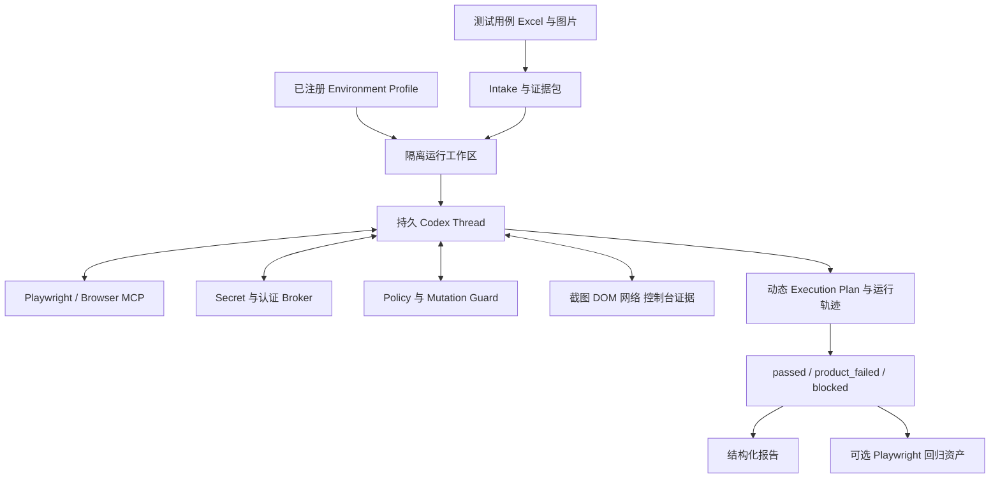

# Auto-Test 架构实践复盘：从 IR/Runtime 到 Codex-native 测试代理

记录日期：2026-08-01

记录范围：从旧仓库审计与清理开始，到 IR/Runtime 方案建设、真实业务闭环验收、跨场景与 Windows 复验，再到 Codex-native 架构决策。

## 1. 为什么要留下这份记录

这不是一份用于证明项目成功的宣传材料，也不是一份把全部问题归结为“模型能力不够”的失败总结。

这次实践最值得记录的部分，是我们围绕一个真实、合理但极其困难的业务目标，先选择了一条看起来工程上更可控的路线，投入大量时间把它做得越来越完整，也确实在真实业务中取得过阶段性成功，最后却发现这条路线的核心抽象与业务目标并不匹配。

最初业务目标可以概括为：

> 测试工程师完成一次必要的环境注册后，只需要提供包含详细步骤、预期结果、测试数据和图片证据的测试用例文件，系统就能自主理解用例、探索真实页面、根据页面证据持续调整执行方案、完成真实测试、恢复产生的业务副作用，并交付可信结果。

我们最初把这个目标理解为一个“AI 编译 + 确定性执行”问题：

```text
URL + Excel
  -> Intake
  -> Test Case IR / Workflow IR
  -> AI Planner
  -> 页面探索与 Locator 验证
  -> Refiner
  -> 审核后的 Execution Plan
  -> 确定性 Runtime
  -> 测试报告
```

经过真实验收后，我们最终认识到：

> 首次接入陌生业务场景，本质上不是一个可以在执行前完整编译的问题，而是一个需要持续观察、行动、验证和重新规划的 Agent 问题。

因此，最终架构方向调整为：

```text
测试用例 + 已注册环境
  -> 持久 Codex 测试会话
  <-> 受控 Playwright / MCP 工具
  <-> 页面证据、业务状态和恢复工具
  -> 动态工作计划与执行轨迹
  -> 结构化测试结果
  -> 可选的确定性回归资产
```

这份文档记录中间每一步为什么当时看起来合理、实际解决了什么、又为什么最终不能支撑目标。

## 2. 最终结论先行

本次实践的最终结论不是“自动化测试框架没有价值”，也不是“IR 和 Runtime 完全没有价值”。更准确的结论是：

1. IR、验证器和确定性 Runtime 适合已经理解清楚、已经探索成功、业务语义稳定的回归资产。
2. 它们不适合作为首次接入任意真实业务场景时的主要智能执行主体。
3. 把 Codex 限制为一次性结构化 Planner，再让低智能 Runtime 执行，会显著损失 Codex 直接处理任务时的上下文、工具使用和动态推理能力。
4. 首次执行应由一个持久 Codex 会话同时承担理解、探索、规划、执行、验证和修复。
5. Auto-Test 仍然需要存在，但角色应从“替代 Codex 的执行引擎”转为“Codex 周围的环境、安全、证据、恢复和交付控制面”。
6. Execution Plan 应从首次执行前的强制完整程序，降级为运行中的动态工作记录，以及首次成功后的可复用回归资产。

对原业务目标而言，IR/Runtime 为中心的首次执行主链路属于不可用路线。这里的“不可用”有明确范围：

- 不是说 Runtime 不能执行任何测试；
- 不是说已经打磨好的 Execution Plan 不能稳定重放；
- 而是说它不能可靠完成“冻结框架后，只提供新场景测试用例，自主从零探索并执行到底”这个核心目标。

## 3. 阶段总览

| 时间 | 阶段 | 当时的核心判断 | 最终评价 |
|---|---|---|---|
| 2026-07-27 至 07-28 | 旧仓库与历史方案审计 | 旧实现缺少可信输入、执行和结果契约，应清理重建 | 正确 |
| 2026-07-28 | Test Case IR MVP | 先把自然语言用例编译成严格 IR，再生成 Playwright | 对稳定回归有价值 |
| 2026-07-28 | Workflow Runtime | 跨站点、有副作用的流程需要实体捕获、状态和恢复 | 正确且可复用 |
| 2026-07-28 至 07-29 | 真实充电闭环 | 先证明真实业务可以被自动执行和安全清理 | 真实业务能力得到证明 |
| 2026-07-29 | AI Planner、Explorer、Refiner | 让 AI 自动生成并打磨 Execution Plan | 局部成功，但成本和脆弱性极高 |
| 2026-07-29 | Autonomous Controller | 用状态机、Policy Gate 和 Mutation Ledger 实现无人值守 | 安全控制有价值，主执行抽象仍错误 |
| 2026-07-30 | 跨场景验收 | 使用另一套真实业务用例证明通用性 | 暴露大量结构化规划和探索问题 |
| 2026-07-31 | Windows 产品化 | 做成测试工程师可双击使用的私有包 | 安装与环境问题解决，核心能力未被证明 |
| 2026-08-01 | Windows 真实复验 | 用冻结包重新跑充电场景 | 未进入充电，证明产品目标仍未实现 |
| 2026-08-01 | 架构复盘 | 对比直接 Codex 与框架执行效果 | 决定转向 Codex-native |

## 4. 起点：旧仓库为什么必须清理

### 4.1 旧仓库不是一个边界清晰的工程

审计前的仓库混合了正式实现、外部项目副本、Python 实验、真实输入、截图、运行日志、大批量结果和前端依赖。

主要内容包括：

- 约 341 MB 的旧 `platform/` 主线；
- 约 472 MB 的多轮 `run_tests/` 实验；
- 多个外部自动化或 Agent 项目完整副本；
- 约 95 MB 的根目录结果 Excel；
- 真实凭据、API 配置和业务数据曾在实验脚本中出现。

正式源码、参考材料、私有数据和生成产物没有明确边界，继续在原结构上修补会让任何结论都不可审计。

### 4.2 旧主线的“已支持数千条用例”并不成立

旧 README 曾给出数千条用例已经导入和回归的印象，但数据库审计显示：

- 用例总数约 3578 条；
- 只有 2 条完成解释；
- 只有 1 条形成已解析步骤；
- 只有 1 条被标记为已录制；
- 唯一真正录制和重放的对象是本地构造的登录 fixture。

这意味着旧主线只证明了一个人工控制的演示页面能够运行，没有证明历史真实用例可以执行。

### 4.3 旧实现存在系统性假通过

旧浏览器工具在动作失败时返回错误对象，但上层只等待调用结束，不检查失败状态。由此产生一系列假通过：

- 点击、输入或选择失败后仍继续；
- 录制结束后无条件标记为成功；
- 多级导航失败后把错误页面 URL 记录为目标；
- 未知动作降级成点击；
- `wait` 不等待真实条件；
- AI 找不到目标时仍被要求返回“最接近”的元素；
- 文本断言退化为整页关键词搜索；
- 没有断言的用例也可能通过；
- 浏览器崩溃后仍继续处理后续用例；
- 失败用例的运行状态也可能被统一写成完成。

历史批量日志中，约 3143 条待执行用例运行超过 6 小时，只有 76 条被标记为通过，通过率约 2.4%。其中部分“通过”仅代表页面加载或页面中出现了某个词，不能作为业务通过证据。

### 4.4 第一个正确决定：清理，而不是继续补规则

因此当时做出的决定是：

- 不继续修补旧 `platform/`；
- 把真实输入和历史结果移出正式工作树；
- 把外部仓库副本移出；
- 保留 Git 历史以供回溯；
- 从输入契约、IR、断言、风险和证据重新建立可信链路。

这一决定至今仍然正确。后续架构转向并不否定最初清理工作的必要性。

## 5. 第一次重建：为什么选择 IR + 确定性 Runtime

### 5.1 当时的设计动机

面对旧系统的假通过，最自然的反应是加强确定性和可审计性。

当时希望建立以下不变量：

1. Excel 必须按表头映射和校验，不能按列号猜测。
2. 每条测试必须有明确断言。
3. AI 不得修改测试工程师定义的业务预期。
4. 每个定位器必须有来源并经过真实页面验证。
5. 写入和破坏性动作必须显式授权。
6. 测试数据和凭据必须使用 `secretRef`，不能进入代码或报告。
7. AI 只负责把自然语言编译成可审核资产，正式执行阶段不再依赖 AI。
8. 只有完整重放通过才算测试通过。

在这些目标下，IR/Runtime 路线非常合理：

```text
自然语言用例
  -> 结构化 IR
  -> 严格校验
  -> Playwright 代码或 Runtime Plan
  -> 确定性重放
```

它可以带来：

- 可重复；
- 可审核；
- 成本可控；
- 执行结果容易比较；
- AI 不能在运行时随意改变断言；
- 测试资产可以进入持续回归。

真正的问题不在于这套设计本身错误，而在于后来把它从“稳定回归资产格式”扩展成了“任意新场景的首次执行主体”。

### 5.2 Test Case IR 建设内容

新 MVP 逐步实现了：

- 多种 14 列、16 列和简化 Excel 模板的表头映射；
- HTML 数字实体、换行和编号格式归一化；
- 重复 ID、空预期、非法风险和缺少清理步骤诊断；
- 明文凭据和个人标识替换为未解析 `secretRef`；
- 步骤、断言、数据绑定、风险和清理步骤 IR；
- JSON Schema 和编译前语义验证；
- allowed origin、秘密引用和审核门；
- Playwright Test TypeScript 代码生成；
- source map，将 Excel、IR、代码和报告关联起来。

这些内容解决了旧系统最严重的可信度问题，也仍然适合保留。

### 5.3 页面探索与受限修复

为了避免 AI 直接编造定位器，又增加了：

- Playwright CLI 探索会话；
- ARIA 快照和候选 Locator 解析；
- 定位器唯一性、可见性、启用状态和刷新稳定性检查；
- 禁止依赖临时 snapshot ref；
- locator 与 wait timeout 的受限修复；
- 保护投影，禁止 AI 修改动作、断言和风险；
- 失败分类和 before/after diff；
- JSON 和静态 HTML 报告。

在本地登录 fixture 和小型确定性用例中，这套机制是有效的。

### 5.4 最初没有覆盖的目标后来不断扩大

最初 MVP 明确不包含：

- 多网站跨系统事务；
- 无人批准的支付、删除、结算和强制停止；
- 运行时完全依赖 LLM Agent；
- 复杂物理设备状态；
- 任意工作流型 Excel；
- 从零理解图片中的业务步骤。

后来真实充电场景恰好同时包含了上述几乎全部复杂度。为了满足真实业务，原本相对清晰的 Test Case IR 开始扩张成 Workflow IR、Execution Plan、实体模型、恢复契约和自主状态机。

## 6. 真实业务把问题变成了另一种问题

### 6.1 虚拟充电闭环的实际复杂度

历史充电测试不是普通的登录、搜索或表单提交，而是一个跨三个站点的长事务：

1. 在模拟器后台找到固定设备并启动；
2. 收敛目标枪口的拔枪和插枪状态；
3. 为每个测试手机号创建独立浏览器上下文；
4. 完成 H5 验证码登录；
5. 选择设备编号方式并输入枪口 PIN；
6. 启动真实充电并确认页面进入计费状态；
7. 在商城后台基于执行前订单基线捕获本轮唯一订单；
8. 精确强停本轮订单；
9. 捕获关联占位费订单并结算；
10. 验证没有遗留活跃充电订单和占位费订单；
11. 清理 H5 缓存后处理下一个账号。

此外还有：

- H5 缓存导致 404，需要刷新恢复；
- 父设备编码与实际枪口 PIN 不同；
- 插枪是必要外部状态；
- 后台语言和 SPA 路由会变化；
- 表格数据区和操作区可能是分离的固定列；
- 订单必须按手机号、枪口和执行前后 ID 基线精确关联；
- 余额不足、设备离线、占位费模板未关联都会导致真实业务失败；
- 测试用例中的部分步骤只存在于 Excel 内图片和额外截图中。

这个场景证明：真实自动化测试不仅是“找到元素然后点击”，还包括业务实体、状态机、外部权限、副作用和恢复。

### 6.2 手工勘察和专用脚本首先跑通了业务

在构建通用框架前，通过浏览器勘察和专用 Playwright/Python 流程，业务闭环确实被跑通：

- 模拟设备在线；
- H5 能使用正确枪口 PIN 进入可启动状态；
- 真实充电订单被创建；
- 订单被精确强停；
- 关联占位费订单被结算；
- 最终没有遗留活跃对象。

这一步非常重要，因为它给后续框架提供了真实业务基准，也暴露了旧自动化将“页面未报错”误判为成功的问题。

但它仍然是开发者理解业务后写出的场景专用实现，不能证明跨场景能力。

## 7. Workflow Runtime：阶段性最扎实的成果

### 7.1 为什么需要新的 Runtime

普通 Playwright Test IR 无法表达：

- 多站点 target；
- 多账号 `forEach`；
- 每账号新 BrowserContext；
- 跨阶段实体捕获；
- 数据表与操作表对齐；
- 中断恢复；
- 破坏性动作和补偿；
- 最终安全审计。

因此建立了 Workflow Execution Plan 和 Runtime。

### 7.2 Runtime 的关键能力

Runtime 最终实现了：

- group、phase 和 iteration 编排；
- `shared`、`freshPhase`、`freshPerIteration` 上下文生命周期；
- write/destructive 权限门；
- 每一步的 allowed origin 检查；
- 唯一表格实体捕获；
- `entities.<name>.id` 跨阶段引用；
- 表格行按实体 ID 实时重查；
- 活跃对象计数与终态排除；
- 原子私有状态、cursor 和显式恢复；
- 运行证据、实体证据和错误证据；
- 每轮和最终的安全审计。

### 7.3 Runtime 确实完成过真实闭环

经过已审核 Execution Plan，Runtime 完成过：

- 单账号线上 canary：11/11 phase、61/61 steps、14/14 assertions；
- 完整 7 账号回归：7/7 充电订单结束、7/7 占位费订单结束并支付、最终活跃对象为 0；
- AI 生成计划后的独立账号 Runtime：15/15 phase、88/88 steps、21/21 assertions；
- 后续 autonomous v8 最终 Runtime：15/15 phase、91/91 steps、21/21 assertions。

这些结果说明 Runtime 不是虚假的演示代码。只要 Execution Plan 足够正确，它可以可信地执行复杂真实业务。

### 7.4 这里出现了第一个容易混淆的结论

当 Runtime 跑通后，我们一度容易把下面两个命题混在一起：

1. 一个正确的 Execution Plan 可以被 Runtime 自动执行；
2. 系统可以只从新测试用例自动得到这个正确 Execution Plan。

第一个命题已经被真实证据证明。

第二个命题当时还没有被证明，但后续交流中多次被表述得过于乐观。这成为后面最重要的验收口径错误。

## 8. 从手工 Plan 到 AI Planner、Explorer 和 Refiner

### 8.1 目标

为了补齐“原始输入到 Execution Plan”的缺口，建立了：

```text
Workflow Intake
  -> AI Planner Draft
  -> 页面探索
  -> Exploration Report
  -> Refiner
  -> 新 Draft
  -> Policy Gate
  -> Execution Plan
  -> Runtime
```

Planner 接收：

- Excel 解析结果；
- Excel 内嵌图片；
- 额外截图；
- 测试工程师的详细业务说明；
- 已注册环境中的只读上下文。

Refiner 可以根据真实页面证据修改步骤和定位器，但必须保持：

- 测试预期；
- 风险等级；
- 数据绑定；
- 实体关联；
- 恢复语义；
- source refs。

### 8.2 经过多轮打磨后，AI 生成计划也曾成功

最终 `charge.refined12.plan-draft.json` 完成过完整探索：

- 15/15 phases；
- 88/88 steps；
- 21/21 assertions；
- 75 个 locator resolution；
- 13 个 table contract；
- 0 unresolved locator/table。

审核后生成的 Execution Plan 与历史手工 Plan hash 不同，并使用另一个账号完成正常 Runtime。

这证明 AI Planner 和 Refiner 并非完全无效。它们可以在充分证据、充分轮次和持续开发支持下生成可执行计划。

### 8.3 但“多轮 Refiner”仍然没有解决核心问题

Refiner 每轮接收的是被压缩后的：

- Draft JSON；
- exploration failure；
- 部分页面证据；
- 固定输出 Schema。

它不是一个持续操作浏览器、保持完整任务上下文的测试工程师 Agent。

因此每轮只能修复最早暴露的问题。后续页面、弹窗、表格和业务状态必须等前面全部通过后才能被观察。这导致长流程呈现线性甚至组合式增长：

```text
修复登录
  -> 才能看到菜单
  -> 修复菜单
  -> 才能看到列表
  -> 修复列表
  -> 才能看到详情
  -> 修复详情
  -> 才能看到下一站点
  -> 继续下一轮
```

对于 15 个 phase、数十个定位器和多个动态表格，这种“执行前把所有未知量编译完”的方式成本极高。

## 9. Autonomous Controller：安全设计正确，智能边界仍然错误

### 9.1 为什么增加 Autonomous Controller

为了避免聊天代理手工一轮轮启动 Refiner，又实现了持久化 Autonomous Controller：

```text
planning
  -> exploring
  -> refining
  -> exploring
  -> policy_gate
  -> executing
  -> passed | product_failed | blocked
```

它负责：

- 持久化 Job 状态；
- bounded refinement；
- 环境错误重试；
- Policy Gate；
- Runtime 失败反馈；
- blocked 后恢复；
- 结构化 Human Input Request。

### 9.2 Mutation Ledger 和恢复契约是正确成果

真实业务执行中，失败可能发生在已经创建订单、启动设备或改变枪口状态之后。

因此 write/destructive phase 必须声明：

- `retry`：整个 phase 已证明幂等；或
- `compensate`：后续 phase 能恢复到验证过的干净状态。

Runtime 记录不可变 Mutation Ledger。只有 `retry_ready` 或 `compensated` 才允许自动重新规划。`started`、`committed`、`failed`、`interrupted` 和 `compensation_failed` 必须 fail closed。

这套安全控制在 Codex-native 架构中仍应保留。

### 9.3 Autonomous cold-start v8 的真实含义

v8 最终确实从 Planner 重新生成 Round 0 Draft，没有直接使用历史 `charging.execution-plan.json`，并最终得到：

- Job outcome `passed`；
- 20 轮 Refiner；
- 4 次 Runtime；
- 最终 15/15 phases、91/91 steps、21/21 assertions；
- 真实充电、强停、占位费结算和最终安全审计通过。

但这次运行不能定义为“只给 URL + Excel，无人干预稳定跑到底”，因为它还包含：

- 15 段详细业务 brief；
- Excel 内 6 张图片；
- 额外 2 张截图；
- 已注册环境、登录状态和权限；
- 私密手机号、OTP 和测试数据；
- 多次外部模型服务恢复；
- blocked 后重新启动同一 Job；
- refinement ceiling 从 12 扩展到 24；
- mutation 分类调整后恢复；
- Policy Gate 阻断后的恢复。

它证明了“这套架构可以在开发验收期间被推动到成功”，没有证明“冻结产品可以自主处理一个新场景”。

## 10. 验收口径曾经发生的错误

这次实践中最需要避免重复的错误，不是某个 XPath 写错，而是把不同层次的“通过”混为一谈。

建议以后始终区分以下验收层级：

| 层级 | 问题 | 历史状态 |
|---|---|---|
| 业务可行性 | 人或专用脚本能否完成真实业务闭环 | 已证明 |
| Runtime 可行性 | 正确 Execution Plan 能否自动执行 | 已证明 |
| AI Plan 可生成性 | Planner/Refiner 能否最终生成可执行计划 | 在已知场景中证明过一次 |
| 自治 Job 可收敛性 | 无人工改 Plan，Controller 能否内部迭代到通过 | 在开发者监督和外部恢复下证明过一次 |
| 冻结产品冷启动 | 不改框架、不提供 Draft/Seed，只输入用例能否完成 | 未证明 |
| 跨场景通用性 | 陌生真实业务能否以同一冻结版本完成 | 未证明 |
| Windows 产品可用性 | 普通测试机是否能完成上述冷启动 | 复验失败 |

过去把上面第三或第四层的成功，表述成第五和第六层已经成功，是结论夸大的根源。

## 11. 跨场景验收暴露的问题

### 11.1 新回归场景的价值

第二套真实用例包含：

- 多环境后台；
- 图形验证码和登录；
- 业务设备与虚拟设备的创建、绑定和删除；
- 设备类型枚举；
- 固定业务数据与租户权限；
- Test 和 UAT 环境差异。

这比继续重复充电场景更能检验通用性。

### 11.2 框架出现的典型失败

真实 Job 记录包括：

- Planner 生成的数组或结构缺失，运行时读取 `forEach` 失败；
- 大量 unresolved locators 和 unresolved tables；
- 计划中的 assertion state 无效；
- write phase 缺少 recovery contract；
- Recovery Planner 尝试改变受保护业务语义；
- 页面真实可选项中没有测试用例要求的设备类型；
- 租户被禁用，但旧分类器把登录页当成 locator 问题；
- 浏览器 context 被关闭；
- 模型输出包含多余 JSON 内容，解析失败；
- 多轮探索仍无法稳定构造表格契约。

其中一部分是框架缺陷，一部分是环境或测试数据缺失。正确的系统应能区分两者，并在缺少权限或业务选项时主动请求补充。

### 11.3 跨场景中也存在局部成功

后续记录中：

- 一个业务 CRUD 子场景在 Round 5、一次 Runtime 后通过；
- 一个 UAT 只读场景在 Round 3、四次 Runtime 后通过；
- Test 95 的完整授权场景仍可能在 12 轮后以 30 个 unresolved locator、16 个 unresolved table 结束；
- 设备类型缺失时能够正确产生结构化 Human Input Request。

这些结果说明通用组件不是完全无效，但它们没有形成稳定的首次执行产品能力。

## 12. Windows 产品化为什么没有解决核心问题

### 12.1 Windows 适配完成了很多基础工程

为了让测试工程师直接使用，后续实现了：

- `Auto-Test.cmd` 中文入口；
- Node.js、Codex CLI、依赖和 Chromium 自动准备；
- Windows PowerShell 兼容；
- 私有 API 配置和 DPAPI 保护；
- 独立 `CODEX_HOME`；
- 环境注册向导；
- 可见浏览器运行；
- Playwright 镜像下载和回退；
- 启动诊断、JSONL 事件和中文结果摘要；
- Windows CI 验证。

这些工作解决了“框架在测试工程师电脑上根本启动不了”的问题，是必要的产品化基础。

### 12.2 但安装成功不等于自动测试成功

在真实 Windows 机器上重新运行虚拟充电用例时，框架最终做到：

- 启动模拟器；
- 完成订单前置零状态检查；
- 拔枪和插枪状态检查；
- 完成 H5 国家、手机号、验证码登录；
- 进入充电方式页面。

但框架选择了错误的启动方式，随后在输入枪口 PIN 前失败，没有进入充电状态，也没有创建订单。

Job 最终为 `product_failed`，Round 3。恢复链确认没有遗留业务副作用。

这次失败非常关键，因为它发生在同一个已经被 Linux 充分打磨过的业务场景中。它证明了：

- Linux 成功没有形成可稳定复现的产品能力；
- Windows 问题不只是安装和路径兼容；
- Planner/Explorer 对页面语义的理解仍然不稳定；
- 之前的验收不能扩展成“跨平台 URL + Excel 已实现”。

### 12.3 调试过程中开始出现危险的场景过拟合

为了追逐 Windows 页面失败，未提交代码一度加入：

- “枪号、插枪、拔枪”关键词识别；
- 固定 Element Plus 表格列 XPath；
- `Device number starts charging` 字面值选择；
- 针对当前 H5 页面的语义排除规则。

这些修改会让充电场景暂时更容易继续，但会把通用探索器变成充电专用执行器。

在发现该问题后，全部未提交修改已经清理，工作树恢复到分支基线。这个插曲进一步说明：

> 当一个所谓通用框架必须不断吸收具体业务词典和 DOM 结构才能继续时，问题通常不是缺少更多规则，而是抽象层级错误。

## 13. 为什么直接 Codex 的效果反而更好

### 13.1 直接 Codex 拥有完整闭环

把测试用例直接交给 Codex 时，它可以：

- 阅读完整自然语言和图片；
- 在同一个长期上下文中记住业务目标；
- 通过 shell、SSH、Playwright 和页面证据进行主动调查；
- 在操作失败后立即查看当前真实页面；
- 临时编写和修改运行脚本；
- 调整下一步动作，而不是重新生成整份计划；
- 对异常页面、缓存、路由、权限和业务数据做联合判断；
- 在确认真实订单后再执行后续强停和清理；
- 根据最终业务状态给出结论。

它的执行方式天然是：

```text
理解 -> 行动 -> 观察 -> 判断 -> 修正 -> 继续
```

### 13.2 当前框架如何压缩了 Codex 能力

当前 `CodexCliWorkflowPlanner` 主要以如下方式调用 Codex：

- `codex exec`；
- `--ephemeral`；
- `--sandbox read-only`；
- `--ignore-rules`；
- 固定 `--output-schema`；
- 工作目录是 Planner workspace；
- 最终只接受 `planJson + summary`。

也就是说，Codex 被降级成一个一次性结构化模型调用：

```text
输入被压缩的 Intake 和证据
  -> 返回 JSON
  -> 会话结束
```

它不能在该调用中：

- 操作真实浏览器；
- 验证自己的假设；
- 在执行后继续推理；
- 保留完整的长期任务状态；
- 自主创建临时探测代码；
- 在同一思维链路中完成探索和业务断言。

随后框架把页面探索、Locator 解析、Refiner 和 Runtime 拆成独立组件。每个组件都有更少的上下文和更窄的操作集合。

因此，直接 Codex 明显优于框架不是偶然，而是当前架构主动丢弃了 Agent 最有价值的能力。

## 14. IR/Runtime 主路线的硬性缺陷

### 14.1 把开放世界任务当成封闭编译问题

传统编译成立的前提是：

- 输入语言相对完整；
- 目标语义明确；
- 编译器可以在执行前知道足够多的信息。

真实 Web 测试首次接入不满足这些前提：

- 页面状态只有运行时才知道；
- 登录后才能看到菜单；
- 操作后才能看到弹窗和下一页；
- 表格列和空状态可能动态变化；
- 测试数据和租户配置决定可用选项；
- 同一个按钮可能根据业务状态改变含义；
- 产品缺陷、环境问题和测试代码问题可能同时出现。

要求 Planner 在执行前生成完整正确的步骤、Locator、表格契约、实体规则和恢复策略，本质上要求它在没有完整观察世界前预测世界。

### 14.2 Schema 过早固化不确定判断

严格 Schema 能防止格式错误，但也会迫使模型在证据不足时过早决定：

- 页面层级；
- 菜单名称；
- Locator strategy；
- 表头；
- 实体 ID 正则；
- 恢复阶段；
- 上下文生命周期；
- assertion kind。

这些决定一旦进入保护投影，Refiner 又不能轻易修改。保护越严格，错误假设越难修；保护越宽松，AI 越可能改掉业务语义。

这是一个结构性矛盾，而不是增加更多校验器就能完全解决的问题。

### 14.3 Planner、Explorer、Refiner、Runtime 上下文割裂

四个角色之间通过 JSON 和错误摘要通信：

- Planner 没有真实页面；
- Explorer 没有完整业务推理能力；
- Refiner 只看到压缩证据；
- Runtime 没有动态推理能力。

任何证据遗漏或摘要偏差都会在下一阶段被放大。

直接 Codex 则在同一会话中保留完整上下文，不需要反复把世界压缩成中间格式。

### 14.4 首次执行和稳定回归被错误地合并

首次执行需要：

- 开放式探索；
- 动态判断；
- 页面和业务知识获取；
- 失败后改变策略。

稳定回归需要：

- 可重复；
- 快速；
- 低成本；
- 严格断言；
- 最小变化。

这两种模式不应该由同一个确定性 Runtime 从第一分钟开始承担。

正确顺序应是：

```text
首次场景：Agent 自主探索和执行
  -> 成功后沉淀回归资产
  -> 稳定场景：确定性快速重放
  -> 页面漂移：再次唤醒 Agent 修复
```

### 14.5 增加 Refiner 轮数只是在延迟失败

v8 从 12 轮扩展到 24 轮后最终成功，但这带来：

- 数小时运行；
- 大量模型调用；
- 多次 blocked/resume；
- 多次 Runtime 失败；
- 复杂的状态恢复；
- 难以判断结果来自框架能力还是开发过程推动。

如果每个新场景都需要相似规模的轮次和开发干预，它不具备业务可用性。

## 15. 这条弯路中仍然值得保留的成果

架构转向不意味着删除全部工程。以下能力是 Codex-native 测试代理仍然需要的。

### 15.1 输入和证据

- Excel 表头识别与诊断；
- 自然语言、图片和 source refs 提取；
- WPS `DISPIMG` 图片解析；
- 输入 hash 和可追溯性；
- 敏感内容脱敏。

### 15.2 环境与认证

- Environment Profile Registry；
- Auth Broker；
- storageState 和 sessionStorage；
- 多 origin 覆盖检查；
- Secret Vault；
- Windows NTFS 和 DPAPI 保护。

### 15.3 安全控制

- allowed origins；
- read/write/destructive 权限；
- 测试数据和实体白名单；
- Mutation Ledger；
- retry/compensate 恢复语义；
- 最终零活跃对象审计；
- Human Input Gate。

### 15.4 交付与产品化

- 私有运行目录；
- JSONL 事件；
- 结构化终态；
- 截图、Trace、DOM、网络和控制台证据；
- JSON/HTML 报告；
- Windows 一键安装和启动；
- 依赖、Chromium 和 Codex 诊断。

这些能力应成为新架构的控制面，而不是被丢弃。

## 16. 最终方向：Codex-native 测试代理

### 16.1 产品定义

新的 Auto-Test 不再试图自己成为一个通用智能测试执行器。

它应被定义为：

> 一个为 Codex 提供测试材料、受控浏览器、环境认证、副作用治理、运行状态和交付证据的 AI 测试工作站。

测试工程师的日常输入仍然保持简单：

1. 选择已经注册的测试环境；
2. 选择测试用例 Excel；
3. 启动；
4. 查看实时进度和最终结果。

### 16.2 新执行链路



### 16.3 同一个 Codex Thread 同时承担三种角色

新架构中不再强制拆分 Planner、Refiner 和 Executor。

同一个持久会话负责：

- 理解测试用例；
- 建立初始语义计划；
- 探索页面；
- 执行动作；
- 检查页面和业务状态；
- 根据证据调整下一步；
- 记录副作用；
- 执行清理；
- 给出结果。

它可以更新运行目录中的 `working-plan.json` 或 `working-plan.md`，但这份计划是动态工作记录，不是执行前必须完整批准的静态程序。

### 16.4 Codex 必须拥有真实浏览器工具

Codex CLI 官方没有内置 Browser。直接安装裸 CLI 不会自动获得本次交互中使用过的完整浏览器能力。

因此 Auto-Test 必须提供以下之一：

- 基于现有 Playwright Driver 的本地 MCP server；
- 受控的 Playwright 脚本执行器；
- 两者组合。

工具至少需要支持：

- 打开和关闭 BrowserContext；
- 导航、点击、输入、选择、键盘操作；
- ARIA/DOM snapshot；
- 截图；
- 表格查询；
- console 和 network evidence；
- storage/cache reset；
- URL 和 origin 检查；
- secretRef 注入；
- mutation 记录；
- cleanup 和最终审计。

为了避免重新制造一个过窄 Runtime，Codex 还应被允许在隔离运行目录中创建和修改临时 Playwright 探测脚本，但不得修改 Auto-Test 框架源码。

### 16.5 为什么选择 Codex SDK 或 App Server

官方 Codex SDK 支持：

- 启动本地 Codex thread；
- 在同一个 thread 上连续 `run()`；
- 按 thread ID 恢复历史会话；
- 为不同 turn 设置 sandbox；
- 嵌入 Node.js 应用。

`codex exec` 也支持：

- JSONL 事件流；
- JSON Schema 最终输出；
- session resume；
- 图片输入；
- sandbox 和 approval policy。

当前项目是 TypeScript/Node.js，首个实现优先使用 Codex SDK。App Server 适合后续需要完整客户端、审批 UI 和会话管理时再引入。

参考：

- [Codex SDK](https://learn.chatgpt.com/docs/codex-sdk)
- [Non-interactive mode](https://learn.chatgpt.com/docs/non-interactive-mode)
- [Browser](https://learn.chatgpt.com/docs/browser)
- [Model Context Protocol](https://learn.chatgpt.com/docs/extend/mcp)

## 17. 新旧架构职责映射

| 现有能力 | 新架构中的处理 |
|---|---|
| Excel Intake | 保留，输出给 Codex 的证据包 |
| Test Case IR | 保留为可选标准化输入，不作为首次执行强制程序 |
| Workflow Draft | 降级为动态工作计划或审计记录 |
| Planner Schema | 退出主链路 |
| Locator Resolver | 改为 Codex 可调用的浏览器观察工具 |
| Explorer | 合并进持久 Codex 会话 |
| Refiner | 合并进同一 Codex 会话的观察与修正循环 |
| Policy Gate | 保留，但主要在工具调用边界强制执行 |
| Runtime | 保留为稳定回归和已学习资产的快速执行器 |
| Auth Broker | 保留 |
| Environment Profile | 保留 |
| Secret Vault | 保留并加强隔离 |
| Mutation Ledger | 保留 |
| Recovery Planner | 由 Agent 提议、Guard 验证，不能只依赖模型声明 |
| 报告系统 | 保留并接入 Codex JSONL 与工具证据 |
| Windows 启动器 | 保留，改为启动 Agent Runner |

## 18. 新架构的实施顺序

### 阶段 A：冻结旧主链路并建立直接 Codex 基线

1. 不再继续扩展 Planner/Refiner DSL。
2. 固定当前代码版本。
3. 使用同一测试用例和环境，记录直接 Codex 完成测试的步骤、工具、耗时、模型调用和人工介入次数。
4. 将该结果作为 Agent Runner 的性能基线。

### 阶段 B：建立 Agent Runner 最小闭环

1. 新增每 Job 一个隔离运行目录。
2. Intake 将 Excel、图片和环境摘要生成 `case-bundle`。
3. 使用 Codex SDK 启动一个持久 thread。
4. 给 thread 加载专用 Auto-Test Skill 和 `AGENTS.md`。
5. 允许 thread 在运行目录生成临时 Playwright 脚本。
6. 接收 JSONL 事件并显示中文进度。
7. 通过 output schema 生成最终测试结果。

### 阶段 C：浏览器和安全工具化

1. 将 Playwright 能力暴露为 MCP 或受控命令。
2. 工具层自动记录动作前后证据。
3. Secret 值只在 Broker 内解析，不进入 prompt 和普通日志。
4. 每个写操作携带 risk、sourceRef、目标实体和预期后置状态。
5. Guard 在工具边界检查 origin、权限和恢复能力。
6. 失败时先恢复，再允许 Agent 继续。

### 阶段 D：结果交付

最终结果至少包含：

- `passed`、`product_failed` 或 `blocked`；
- 每条用例和断言结果；
- 实际执行步骤；
- 关键页面证据；
- 发现的产品缺陷；
- 缺少的权限、数据或业务说明；
- 创建或改变的实体；
- 清理和最终状态；
- Codex thread ID；
- 可选回归脚本路径。

### 阶段 E：稳定资产晋升

首次 Agent 执行成功后：

1. Codex 输出经过验证的 Playwright 测试资产；
2. 在独立数据和全新 BrowserContext 中重复验证；
3. 通过后晋升为确定性回归；
4. 后续优先低成本 Runtime 重放；
5. 页面漂移或测试代码失败时重新调用 Codex 修复；
6. 产品断言失败不得自动修改预期。

## 19. 新架构必须采用的验收门

为了避免再次把局部成功解释成产品成功，正式验收必须满足：

### 19.1 冻结性

- 验收前固定 commit 和安装包；
- Job 运行期间不得修改框架源码；
- 不得针对当前业务加入领域词典或 DOM 特判；
- Codex 只能写入本轮隔离运行目录和批准的测试资产目录。

### 19.2 输入边界

- 环境只允许一次性注册；
- 正式运行只选择环境和测试用例文件；
- 不提供历史 Draft、Seed 或 Execution Plan；
- 不手工补写脚本；
- 测试文件缺少关键业务信息时，Job 必须返回结构化 `blocked`，不能猜测。

### 19.3 自主性

- 不人工修改 Execution Plan；
- 不人工选择 Locator；
- 不通过聊天逐步指挥下一动作；
- 模型或网络恢复后自动续接同一 thread；
- 除明确 Human Input Request 外，不依赖人工恢复 Job。

### 19.4 业务真实性

- 必须验证真实业务状态，而不是仅验证点击未报错；
- 必须使用本轮实体而不是第一行、最新行或历史 ID；
- 每个副作用都必须有证据；
- 最终清理必须独立验证；
- 安全终态不能掩盖未完成的业务步骤。

### 19.5 跨场景

至少在冻结版本上完成三个互不相关的真实场景：

1. 多站点、有副作用的长业务闭环；
2. 后台 CRUD 和实体关联；
3. 只读查询、筛选和断言场景。

其中至少一个场景不能参与框架开发过程。

### 19.6 Windows

- 使用普通 Windows 测试机；
- 从私有包全新安装；
- 环境注册后仅选择 Excel；
- 连续运行时不依赖开发者远程修改；
- 最终结果和 Linux 使用同一结构化合同。

## 20. 以后遇到类似问题时的判断清单

### 20.1 什么时候应该使用确定性 Runtime

- 页面和业务流程已经被成功探索；
- Locator 和实体规则已经验证；
- 测试数据和权限稳定；
- 需要高频、低成本重复执行；
- 预期行为清晰；
- 页面漂移频率低。

### 20.2 什么时候必须使用 Agent

- 首次接入新站点或新业务；
- 测试步骤存在图片、隐含流程或自然语言歧义；
- 页面只有执行前序步骤后才可观察；
- 多站点、多角色、多窗口或动态表格；
- 需要根据页面和业务状态改变策略；
- 环境、产品缺陷和测试代码问题需要联合判断；
- 固定 DSL 无法表达必要操作。

### 20.3 何时说明抽象正在过拟合

- 通用模块中开始出现具体业务名称；
- 需要固定某张业务表的列号；
- 需要为某个页面写专门正则才能选择正确按钮；
- 每接入一个业务都要增加新的 step kind；
- Refiner 主要在修 JSON 结构，而不是解决测试问题；
- 增加轮数比提高一次成功率更常见；
- seed/draft 成为正常运行必需品；
- “同一个场景曾经跑通”被用来代替跨场景证据。

## 21. 本次实践最重要的教训

### 教训一：先定义通过的层级

业务闭环通过、Runtime 通过、AI Plan 通过、自治 Job 通过、冷启动通过和跨场景通过是不同结论。

### 教训二：确定性是沉淀阶段的目标，不是首次理解阶段的前提

首次场景应该允许 Agent 在安全工具边界内动态工作。确定性资产应在成功后生成。

### 教训三：安全控制应该限制动作，不应该过度限制思考

allowed origin、Secret、Mutation Ledger 和恢复门应在工具层强制执行。把模型限制为只返回一个巨大 JSON，并不能自动带来安全，反而可能让错误计划显得结构正确。

### 教训四：不要用更多特判修复错误抽象

场景词典、固定 XPath 和页面字面值可以短期推动一个场景，但会破坏跨场景目标。

### 教训五：安装包通过不等于产品能力通过

Windows 启动、依赖安装、API 配置和 Chromium 检查都是必要条件，但不能替代真实业务验收。

### 教训六：直接 Agent 基线必须尽早建立

如果直接 Codex 已经能明显更好地完成任务，框架的每一层都必须证明自己是在增加安全、可用性或复用能力，而不是单纯降低 Agent 能力。

### 教训七：不要过早把成功场景固化成通用结论

一个复杂场景通过只能证明该场景和相关原语。跨场景能力必须由未参与开发的新场景证明。

## 22. 证据索引

仓库内的主要依据包括：

- [仓库与历史方案审计](repository-audit.md)
- [MVP 规格与阶段实现记录](mvp-spec.md)
- [历史充电闭环验收](e2e-charge-acceptance.md)
- [Autonomous Workflow Controller](autonomous-workflow.md)
- [跨场景快速操作指南](quick-start.md)
- [Windows 快速操作指南](windows-quick-start.md)
- `artifacts/planning/charge/charge.refined12.plan-draft.json`
- `artifacts/planning/charge/charge.generated-v2.execution-plan.json`
- `artifacts/acceptance/charge/generated-v2-runtime-offset6.result.json`
- `artifacts/acceptance/charge/autonomous-cold-start-offset6-v8/autonomous-job.state.json`
- `artifacts/acceptance/charge/autonomous-cold-start-offset6-v8/runtime-attempt-4.result.json`
- `artifacts/acceptance/regression/test-95-authorized-v8/autonomous-job.state.json`
- `artifacts/acceptance/regression/test-95-authorized-v11/autonomous-job.state.json`
- `artifacts/acceptance/regression/test95-business-crud-v6/autonomous-job.state.json`
- `artifacts/acceptance/regression/uat-readonly-v1/autonomous-job.state.json`

Windows 真实复验产物包含环境和业务证据，保留在私有测试机运行目录中，不进入仓库。

## 23. 最终决策

停止把下列链路作为首次接入新场景的产品主路径：

```text
AI Planner
  -> 完整静态 IR
  -> 全量页面预探索
  -> 多轮 JSON Refiner
  -> 静态 Execution Plan
  -> 无智能 Runtime
```

转向：

```text
Intake + Environment Profile
  -> 持久 Codex 测试 Thread
  <-> Playwright / MCP / Secret / Policy / Recovery Tools
  -> 根据实时证据持续计划和执行
  -> 可信终态与报告
  -> 可选确定性回归资产
```

本次尝试不是没有产出。它建立了输入、断言、证据、安全、恢复和 Windows 产品化的基础，也通过真实业务证明了 Runtime 和部分通用原语的价值。

真正需要放弃的是一个核心误判：

> 我们曾试图先把一个开放世界的测试工程师任务完整编译成静态程序，再开始真正观察和执行页面。

以后应当让 Codex 保留完整 Agent 能力，让框架负责控制世界、记录世界和保护世界，而不是试图在 Codex 行动前替它预测整个世界。
